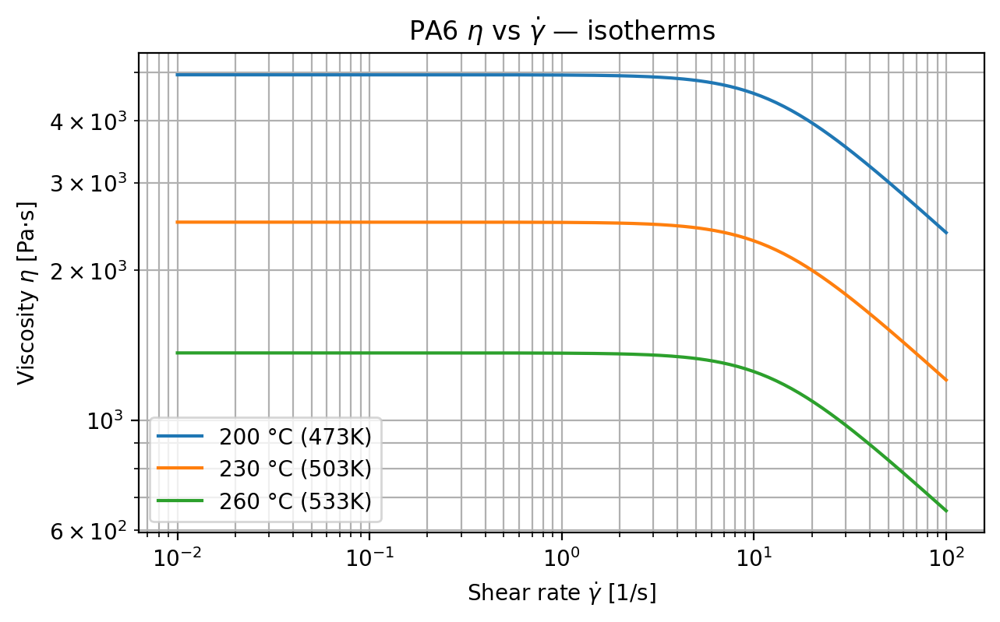
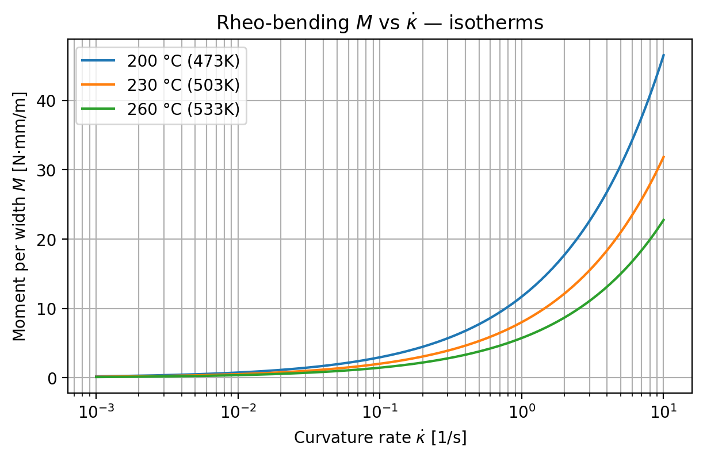
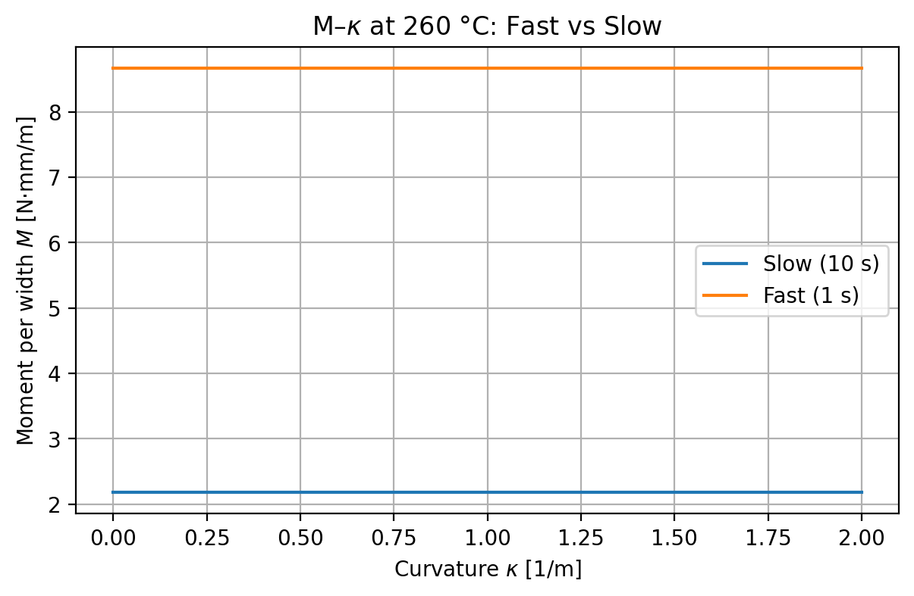

(https://img.shields.io/github/v/release/Sumantballi/PA6-Rheo-Form?sort=semver)](https://github.com/Sumantballi/PA6-Rheo-Form/releases)

## Introduction
This mini-project was inspired by Dennis Brands’ PhD on Forming simulations for unidirectional thermoplastic composites: Improving in-plane shear characterization and modeling; it’s a minimal, practice-oriented replication of key ideas.  
> Thesis: [Forming simulations for unidirectional thermoplastic composites](https://research.utwente.nl/en/publications/forming-simulations-for-unidirectional-thermoplastic-composites-i-2).

This mini-project implements rate–temperature shear and rheo-bending for molten PA6 with a solver-style hook. The current model is isotropic; UD anisotropy can be added 
Outputs: viscosity isotherms (η–γ̇), bending isotherms (M–κ̇), Fast vs Slow M–κ, and a solver-style **material hook**.
No new rheological tests were conducted. Only the constitutive models and plotting workflow are illustrated by the curves used here, which are synthetic/representative and parameterized to fall within published PA6 melt ranges.

## What to look for
- η–γ̇: shear-thinning; 260 °C curve below 230 °C below 200 °C.  
- M–κ̇: M increases with κ̇; hotter is lower.  
- Fast vs Slow (M–κ): Fast > Slow at same κ.  
- CLT vs molten: ratio ≈ 10²–10³ at 230 °C, κ̇≈0.5 s⁻¹.

## Folder map
- `src/` – code (`main.py`, models, plotting)
- `cases/` – parameters (`materials_pa6.json`)
- `data/` – optional CSVs
- `figs/` – generated plots
- `form_cases/dome/` – `material_hook.py` (solver-style call)

## Scope
Constitutive modelling + figures + a solver-ready hook.  
No full contact forming simulation.

## 🔍 Results (quick look)

**CLT vs molten:** [`figs/CLT_vs_molten_ratio.txt`](figs/CLT_vs_molten_ratio.txt)

  
  

  

**CLT vs molten (summary):** see `figs/CLT_vs_molten_ratio.txt`.

## Key Methods & Equations

**Shear (Carreau–Yasuda, with anchored Arrhenius):**  
$$\[\eta(\dot\gamma,T)=\eta_\infty + \big(\eta_0(T)-\eta_\infty\big)\,\Big[1+(\lambda\,\dot\gamma)^a\Big]^{\frac{n-1}{a}},\quad$$
$$\eta_0(T)=\eta_{0,\mathrm{ref}}\exp\!\Big(\frac{Q}{R}\big(\tfrac{1}{T}-\tfrac{1}{T_\mathrm{ref}}\big)\Big)\]$$

**Rheo-bending (viscous, rate- and temperature-dependent):**  
$$\[M = K_b(T)\,\dot\kappa^{\,m},\qquad$$
$$K_b(T)=K_{b0}\exp\!\Big(\frac{Q_b}{R}\big(\tfrac{1}{T}-\tfrac{1}{T_\mathrm{ref}}\big)\Big),\qquad$$
$$D_\text{eq}=\frac{M}{\dot\kappa}\]$$

**CLT vs molten contrast (wrinkling relevance):** compare room-T $$\(D_\text{room}\)$$ to $$\(D_\text{eq}(T,\dot\kappa)\)$$ at forming conditions.

 ## Future-Scope
- **Experimental validation:** Refit shear (Carreau–Yasuda) and rheo-bending parameters; substitute measured PA6 (or UD PA6/CF) data for synthetic curves.
- **Anisotropy (IFRF-lite):** Make bending orthotropic $$(K_b^L vs. K_b^T)$$ and extend shear to fiber-aligned viscosities $$(η_L, η_T)$$.
- **Forming integration:** Apply `form_cases/dome/material_hook.py` to a FE solver (UMAT/VUMAT/plugin) and evaluate it against a benchmark for dome-forming.
- **Thermo-rheology:** Reassess Arrhenius/WLF validity over a broader window; couple temperature fields (T(x,t)) and contact/heat transfer.
 

